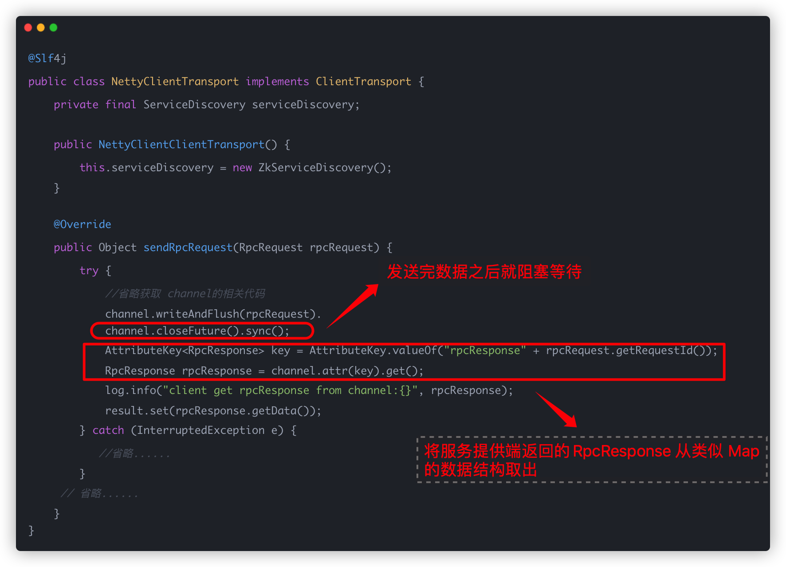
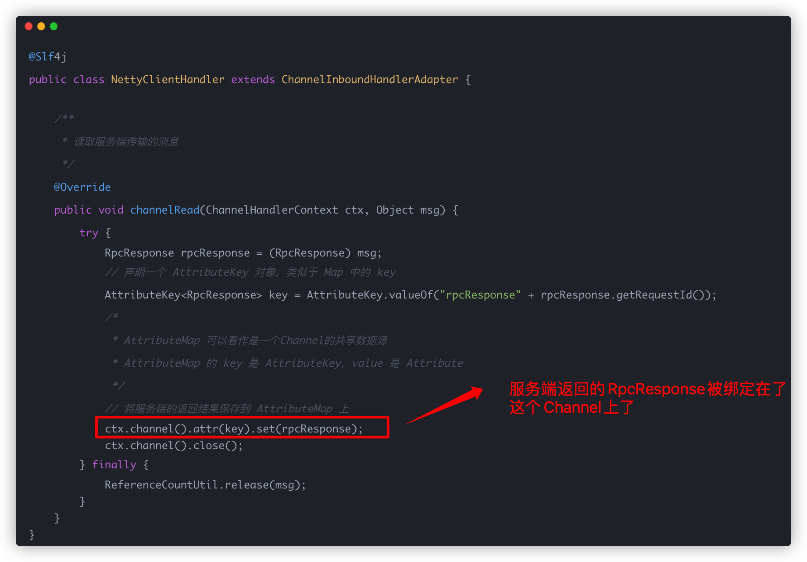
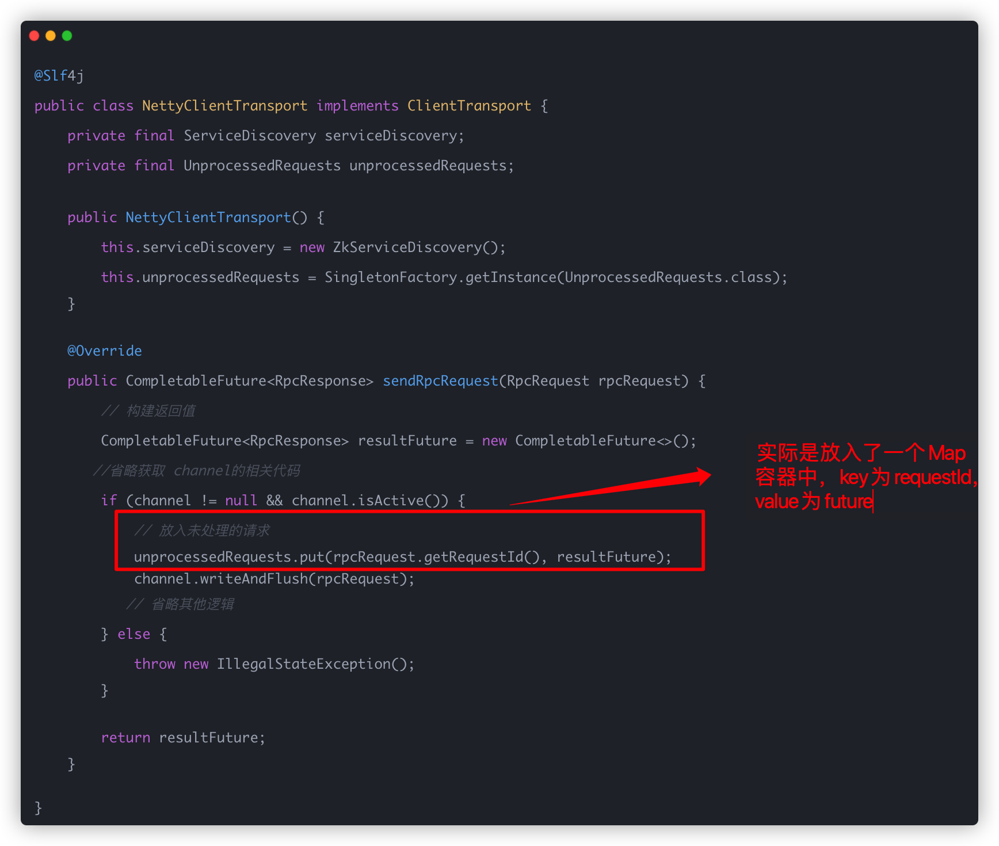
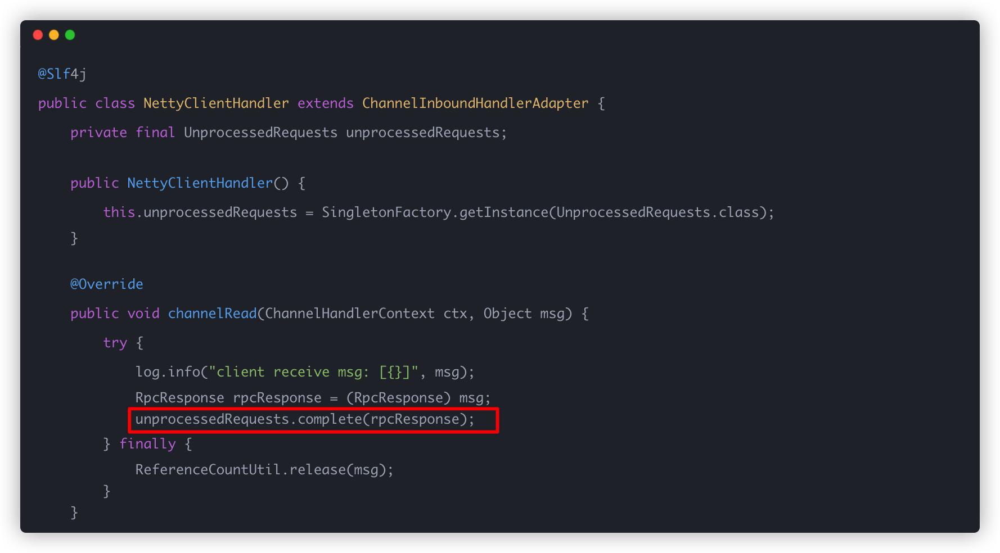
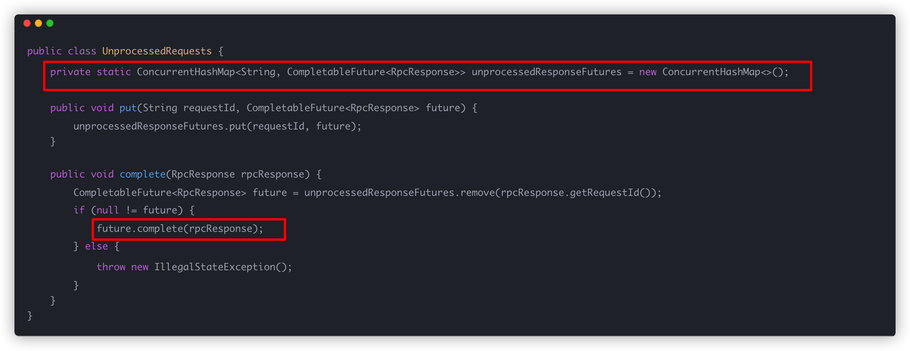

### 使用 AttributeMap 接受服务端返回结果

最开始的时候是通过 `AttributeMap` 绑定到Channel上实现的，相关代码如下：

`NettyClientTransport.java`（用来发送 RpcRequest 请求）



`NettyClientHandler.java` （自定义客户端 ChannelHandler 来处理服务端发过来的数据）



这种是实现的缺点是不清晰，而且你每次都要调用 ` channel.closeFuture().sync();` 阻塞来手动等待请求返回。

### 使用 

CompletableFuture 进行优化

我使用 `CompletableFuture` 包装返回结果，对代码进行了重构，重要部分的代码如下：

`NettyClientTransport.java`（用来发送 RpcRequest 请求）



`NettyClientHandler.java` （自定义客户端 ChannelHandler 来处理服务端发过来的数据）



`UnprocessedRequests.java` 存放了未处理的请求（建议限制 map 容器大小，避免未处理请求过多 OOM



现在，在你只需要通过下面的方式就能成功接收到客户端返回的结果：

```java
CompletableFuture<RpcResponse> completableFuture = (CompletableFuture<RpcResponse>) clientTransport.sendRpcRequest(rpcRequest);
rpcResponse = completableFuture.get();
```

